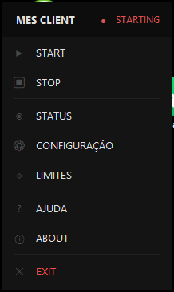
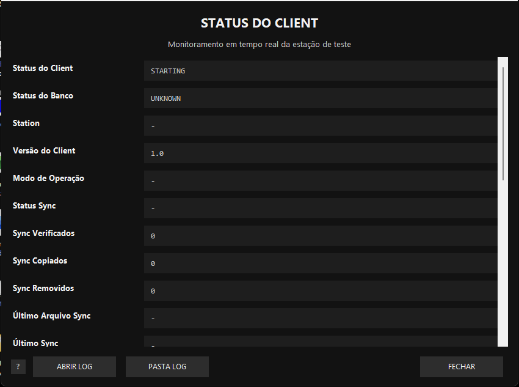
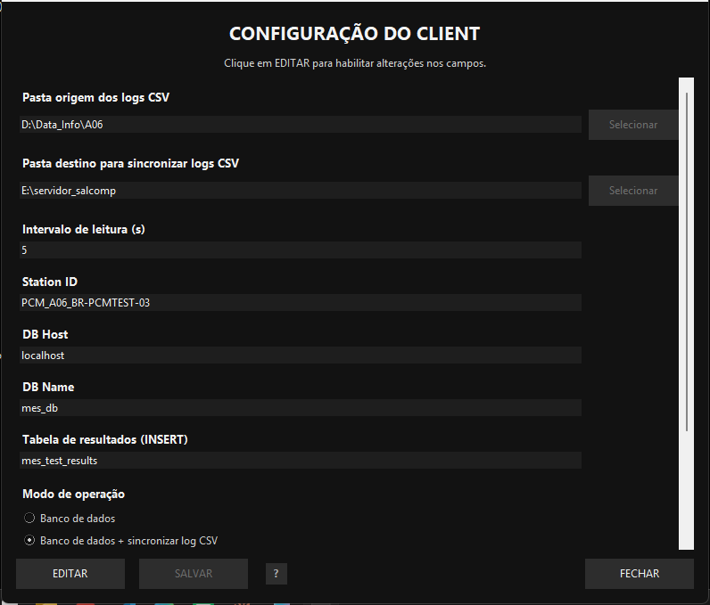
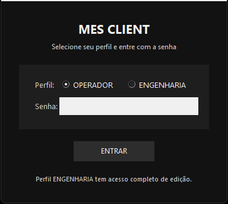
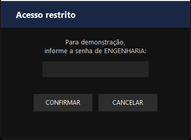
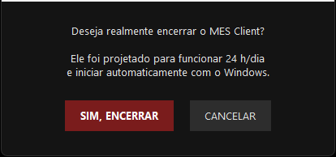

# MES Client — Monitor de Resultados de Teste Industrial

> Sistema de coleta, processamento e rastreabilidade de dados de teste para linhas de produção de baterias e carregadores — Salcomp Manaus.


---

## Screenshots

| Popup dark (bandeja) | Tela STATUS | Tela CONFIG |
|---|---|---|
|  |  |  |

| Login | Acesso restrito | Confirmação EXIT |
|---|---|---|
|  |  |  |

---

## Visão Geral

O **MES Client** é uma aplicação desktop Windows projetada para operação contínua (24h/7d) em estações de teste industrial PCM Tester e CYG/NAVAJO. Ele automatiza o fluxo de dados de teste desde a coleta dos arquivos CSV gerados pelos equipamentos até o armazenamento no banco de dados PostgreSQL central, com sincronização para servidor de rede e validação de limites de especificação em tempo real.

```
PCM Tester / CYG          MES Client (esta aplicação)          Servidor
─────────────────    ─────────────────────────────────    ──────────────────
Gera CSV de teste → Monitor detecta → Parser lê → DB Writer → PostgreSQL
                                                 → File Sync → Samba Share
                                                 → Spec Check → Alertas
```

---

## Funcionalidades

| Módulo | Descrição |
|--------|-----------|
| **Monitor** | Varredura automática de pastas, detecção de arquivos novos/modificados |
| **Parser** | Leitura incremental de CSV (PCM Tester e CYG), leitura só de linhas novas |
| **DB Writer** | Insert/Upsert no PostgreSQL com deduplicação por arquivo + linha de origem |
| **File Sync** | Sincronização para servidor de rede (modos: diff, copy, sync) |
| **Spec Check** | Validação de limites LSL/USL contra `spec_limits.csv` |
| **Buffer** | Fila offline em JSONL — reprocessamento automático ao reconectar |
| **UI** | System tray + janelas modais (Status, Config, Limites, Mapeamento, Ajuda) |
| **Mapeamento** | Editor de `column_mappings.json`: mapeia colunas CSV para campos do banco por modelo, sem abrir código |
| **Auth** | Dois perfis: OPERADOR (visualização) e ENGENHARIA (edição completa) |
| **Installer** | Instalador profissional Inno Setup com wizard de configuração por estação |

---

## Arquitetura

```
MES_Client_Complete/
├── system/
│   ├── ui_main.py          # Interface: system tray, login, STATUS, CONFIG, LIMITES
│   └── single_instance.py  # Garante uma única instância rodando
├── monitor/
│   └── file_monitor.py     # Loop principal: varredura, parse, DB, sync, spec check
├── parser/
│   └── cyg_parser.py       # Leitura incremental de CSV (PCM Tester e CYG)
├── database/
│   └── db_writer.py        # Conexão PostgreSQL, create tables, upsert, batch insert
├── sync/
│   └── file_sync.py        # Sincronização de arquivos para destino de rede
├── spec/
│   └── spec_validator.py   # Validação de limites de especificação
├── buffer/
│   └── queue_buffer.py     # Fila offline JSONL para falhas de conectividade
├── state/
│   ├── runtime_status.py   # Estado thread-safe compartilhado entre módulos
│   ├── offset_manager.py   # Controle de posição de leitura por arquivo
│   └── app_context.py      # Singleton de contexto da aplicação
├── config/
│   ├── loader.py           # Carregamento de config.yaml com suporte a variáveis ${ENV}
│   └── column_mapper.py    # Resolução de campos CSV via column_mappings.json
├── logs/
│   └── logger_setup.py     # RotatingFileHandler, log estruturado
├── installer/
│   ├── MES_Client_Setup.iss            # Script Inno Setup (instalador profissional)
│   ├── Instalar_MES_Client.ps1         # Instalador PowerShell alternativo
│   ├── Testar_Instalador_Local.ps1     # Teste sem servidor de fábrica
│   └── Output/
│       └── MES_Client_Setup_v1.0.2.exe   # Instalador gerado (22 MB, single-file)
├── assets/
│   ├── app.ico                         # Ícone da aplicação (multi-size ICO)
│   ├── installer_banner.bmp            # Painel dark do wizard Inno Setup
│   └── installer_header.bmp           # Header dark das páginas internas
├── config.yaml             # Configuração da estação (gerado pelo instalador)
├── spec_limits.csv         # Limites LSL/USL por modelo e passo de teste
├── column_mappings.json    # Mapeamento colunas CSV → campos do banco (editável via UI)
├── parser_TE.spec          # Spec PyInstaller para compilar o EXE
└── requirements.txt        # Dependências Python
```

---

## Stack Tecnológico

| Tecnologia | Uso |
|------------|-----|
| Python 3.13 | Linguagem principal |
| Tkinter | Interface gráfica (nativa, sem dependências externas) |
| pystray | Ícone na bandeja do sistema (system tray) |
| psycopg2 | Driver PostgreSQL |
| PyYAML | Leitura do config.yaml |
| Pillow | Geração de ícones e imagens |
| PyInstaller 6.20 | Compilação para executável Windows (.exe) |
| Inno Setup 6.7 | Instalador profissional com wizard |
| PostgreSQL 13+ | Banco de dados central |

---

## Instalação

### Opção 1 — Instalador (recomendado para produção)

```
MES_Client_Setup_v1.0.2.exe
```

O wizard guia o técnico por:
1. Modelo do produto (A06, A17, A16...)
2. ID da máquina (BR-PCMTEST-01...)
3. Linha de produção
4. Pasta dos CSVs do TestPad
5. Configurações do banco de dados

O instalador automaticamente:
- Copia os arquivos para `C:\Utility\MES`
- Gera o `config.yaml` personalizado para a estação
- Registra auto-start no Windows Task Scheduler
- Cria atalho na Área de Trabalho

### Opção 2 — Manual (desenvolvimento)

```bash
# 1. Clonar o repositório
git clone https://github.com/seu-usuario/mes-client.git
cd mes-client

# 2. Criar ambiente virtual
python -m venv .venv
.venv\Scripts\activate

# 3. Instalar dependências
pip install -r requirements.txt

# 4. Configurar
cp .env.example .env
# Editar .env com MES_DB_PASSWORD=sua_senha

# 5. Executar
python system/ui_main.py
```

### Compilar o EXE

```bash
.venv\Scripts\pyinstaller.exe parser_TE.spec --noconfirm
# Saída: dist/MES_Client.exe (≈ 20 MB)
```

---

## Configuração

O arquivo `config.yaml` é gerado automaticamente pelo instalador. Exemplo:

```yaml
database:
  host: 10.0.0.100   # IP do servidor PostgreSQL na rede da fábrica
  port: 5432
  name: mes_db
  user: mes_user
  password: ${MES_DB_PASSWORD}   # lido do arquivo .env

station:
  id: PCM_A17_BR-PCMTEST-01
  type: PCM_TESTER
  model: A17
  line: NAVAJO

log:
  folder: D:/Testpad software/CSV/A17
  recursive: true

sync:
  enabled: true
  destination_folder: \\10.0.0.100\shared\logs\A17
  mode: diff

spec_check:
  enabled: true
  file: spec_limits.csv

auth:
  operador_password: ""
  engenharia_password: "admin"
```

---

## Uso

Após a instalação, o MES Client inicia automaticamente com o Windows (Task Scheduler). O ícone de bateria aparece na bandeja do sistema:

- **Clique direito** → abre popup dark premium com status ao vivo e todos os atalhos: START, STOP, STATUS, CONFIGURAÇÃO, LIMITES, AJUDA, ABOUT, EXIT
- **Ícone verde** → monitor ativo, dados sendo enviados ao banco
- **Ícone vermelho** → falha de conexão (fila offline ativa)
- **Ícone amarelo** → iniciando ou aguardando

### Perfis de Acesso

| Ação | OPERADOR | ENGENHARIA |
|------|----------|------------|
| Ver STATUS | ✅ | ✅ |
| Editar CONFIG | ❌ (requer senha) | ✅ |
| Editar LIMITES | ❌ (requer senha) | ✅ |
| Editar MAPEAMENTO | ❌ (requer senha) | ✅ |
| STOP / EXIT | ❌ (requer senha) | ✅ |

---

## Banco de Dados

Tabela principal `mes_test_results`:

| Coluna | Tipo | Descrição |
|--------|------|-----------|
| `id` | BIGSERIAL PK | Identificador único |
| `station_id` | TEXT | Identificador da estação |
| `model_name` | TEXT | Modelo do produto |
| `serial_number` | TEXT | Número de série |
| `result_status` | TEXT | PASS / FAIL |
| `row_data` | JSONB | Dados completos da linha |
| `source_file` | TEXT | Arquivo CSV de origem |
| `source_line_no` | INTEGER | Linha do CSV (deduplicação) |
| `created_at` | TIMESTAMP | Data/hora de inserção |

---

## Deploy em Produção

Para implantar em múltiplas estações PCM Tester na linha de produção:

1. Copie `MES_Client_Setup_v1.0.2.exe` para um pendrive
2. Em cada estação: execute o instalador como Administrador
3. Preencha modelo e ID da máquina no wizard
4. Valide: ícone verde na bandeja + log mostra `MONITOR INICIADO`

Veja o [Guia de Deploy](docs/DEPLOY.md) para o procedimento completo de homologação.

---

## Documentação Técnica

| Documento | Descrição |
|---|---|
| [Suporte a Múltiplos Formatos de CSV](docs/CSV_FORMATS.md) | Como o sistema aceita qualquer CSV sem alterar o banco; como adicionar novos modelos/estações |

---

## Desenvolvimento

### Próximas Etapas (Roadmap)

- [ ] **Fase 2 — Servidor MES**: API REST + Dashboard analítico (PostgreSQL + FastAPI + React)
- [ ] Gráficos de yield por linha, modelo e turno
- [ ] Alertas automáticos por e-mail/Teams quando yield cair abaixo do limite
- [ ] Relatórios PDF automáticos por turno
- [ ] Exportação para Excel

---

## Autor

**Roberto Parente**
Engenharia de Teste Industrial — Salcomp Manaus
[robertotec.eng3@gmail.com](mailto:robertotec.eng3@gmail.com)

---

## Licença

MIT License — veja [LICENSE](LICENSE) para detalhes.

---

*Projeto desenvolvido para rastreabilidade de qualidade em linha de produção de baterias e carregadores — Salcomp Manaus, 2026.*
